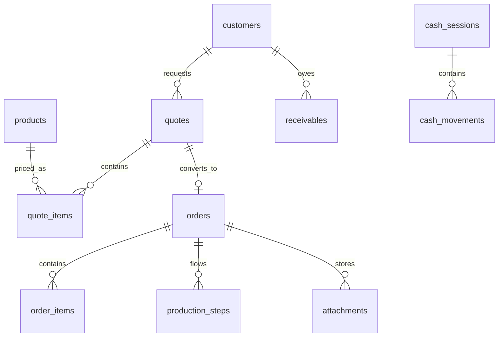

# Arquitetura Do Sistema

## Principios

O sistema deve ser proprio, sem copiar marca, codigo ou identidade visual de sistemas de referencia. A inspiracao fica restrita aos conceitos de operacao: menu por modulos, atalhos, status por cores, fluxo rapido de orcamento e producao com PCP.

## Camadas

### Frontend

- Aplicacao web responsiva
- Dashboard operacional
- Telas de cadastro e operacao
- Fluxo rapido de PDV
- Orcamento por questionario
- Kanban de producao
- Caixa cego para operador

### Backend

- API REST
- Regras de negocio centralizadas
- Motor de precificacao configuravel
- Conversao de orcamento aprovado em O.S.
- Controle de caixa e conferencia cega
- Auditoria de eventos importantes

### Banco De Dados

- Banco relacional, recomendado PostgreSQL
- Chaves estrangeiras para preservar integridade
- Tabelas separadas para financeiro, producao, anexos, usuarios e permissoes
- Auditoria por entidade e usuario

## Modulos

### Dashboard

Mostra vendas, orcamentos, O.S. atrasadas, gargalos por setor, alertas de estoque, tarefas e indicadores de caixa.

### Clientes

Cadastro de clientes, contatos, limite de credito, status de bloqueio, enderecos e historico financeiro.

### Produtos

Cadastro de produtos como faixa, banner, adesivo, ACM, fachada, placa, lona, letreiro, impressao digital, totem e personalizados.

Cada produto possui unidade de calculo, medidas, materiais, equipamentos, setores, margem, custo minimo e regras de precificacao.

### Questionario Configuravel

Cada produto pode ter um questionario proprio. As perguntas definem campos e tambem impactos no preco:

- Valor fixo
- Multiplicador por m2
- Percentual
- Hora/homem
- Hora/maquina
- Material
- Etapa de producao
- Prazo

### Precificacao

O motor calcula:

- Area e quantidade
- Custo de material
- Perda tecnica
- Aproveitamento
- Hora/homem
- Hora/maquina
- Comissao
- Impostos
- Margem
- Preco minimo
- Desconto maximo

### Orcamentos

Fluxo:

1. Selecionar cliente
2. Escolher produto
3. Responder questionario
4. Calcular preco automatico
5. Revisar itens, prazos, anexos e condicoes
6. Enviar, aprovar, recusar ou converter em O.S.

### Ordem De Servico

Ao aprovar orcamento, o sistema gera O.S. com numero, cliente, itens, arquivos, fotos, prazo, prioridade, status financeiro e status produtivo.

### Producao E PCP

Cada produto tem fluxo de setores configuravel. Cada setor registra recebimento, inicio, pausa, problema, finalizacao, tempo gasto, fotos e observacoes.

O PCP mostra atrasadas, para hoje, com problema, paradas, aguardando arquivo, aguardando aprovacao, aguardando material, aguardando pagamento, em producao e finalizadas.

### Financeiro

Inclui contas a pagar, contas a receber, faturamento, fluxo de caixa, fiado, sinais, formas de pagamento e conciliacao.

### Caixa / PDV

Permite abrir caixa, vender, receber O.S., registrar sinal, pagamento fiado, sangria, suprimento e fechamento por conferencia cega.

No fechamento cego, o operador informa valores contados sem ver o valor esperado. O gestor visualiza comparativo, sobras, faltas e divergencias.

### Usuarios E Permissoes

Perfis previstos:

- Administrador
- Gestor
- Vendedor
- Atendente
- Financeiro
- Operador de caixa
- Producao
- PCP
- Almoxarifado

## API Inicial

- `GET /api/dashboard`
- `GET /api/customers`
- `POST /api/customers`
- `GET /api/products`
- `POST /api/quote/calculate`
- `GET /api/quotes`
- `POST /api/quotes`
- `POST /api/quotes/:id/approve`
- `GET /api/orders`
- `POST /api/orders/:id/move`
- `GET /api/production/pcp`
- `GET /api/finance`
- `POST /api/cash/open`
- `POST /api/cash/sale`
- `POST /api/cash/close-blind`

## Entidades Centrais

